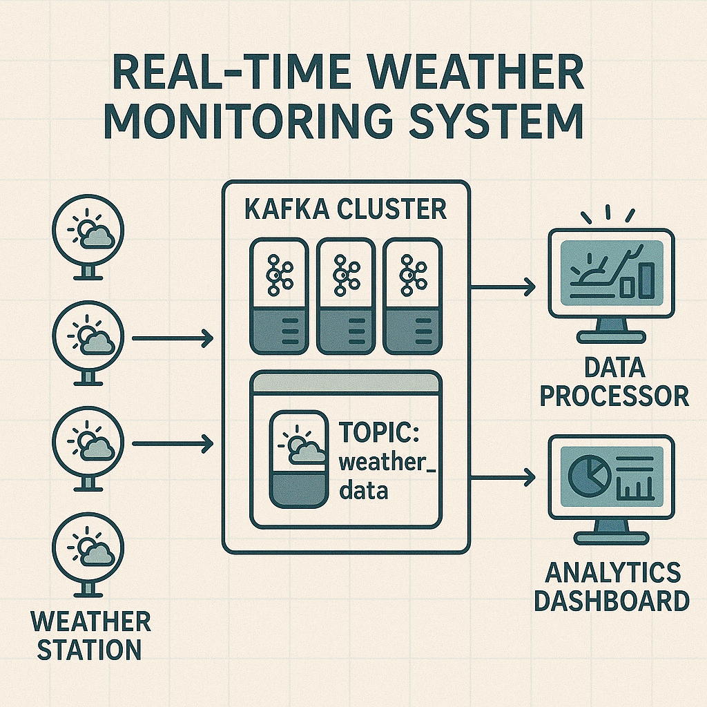

# Real-Time Weather Monitoring System with Apache Kafka



This project demonstrates a simple real-time weather monitoring system built using Apache Kafka and Python. It serves as a hands-on guide for beginners to understand Apache Kafka's core concepts, including producers, consumers, topics, brokers, and basic stream processing.

**Follow the detailed step-by-step tutorial in [`docs/article.md`](docs/article.md).**

## Key Features

* **Real-time Data Ingestion:** Simulates weather stations producing data (temperature, humidity, wind speed) in real-time.
* **Kafka Integration:** Uses Apache Kafka as a distributed messaging backbone for data streams.
* **Data Production:** Python script (`producer.py`) sends weather data to a Kafka topic.
* **Data Consumption:** Python script (`consumer.py`) reads and processes weather data from Kafka.
* **Basic Stream Analytics:** Python script (`analytics.py`) consumes weather data, performs simple analysis (e.g., detecting extreme weather conditions), and produces alerts to a separate Kafka topic.
* **Dockerized Environment:** Kafka and Zookeeper run in Docker containers for easy setup and consistent deployment using `docker-compose`.
* **Logging:** Python scripts log their activities to files in the `logs/` directory for easier debugging and review.

## Technologies Used

* **Apache Kafka:** Version 7.6.0 (Confluent Platform distribution)
* **Apache Zookeeper:** Version 7.6.0 (Confluent Platform distribution, for Kafka coordination)
* **Python:** Version 3.x
* **`kafka-python` library:** Version 2.2.6 (for Python Kafka client)
* **Docker & Docker Compose:** For containerization and orchestration of Kafka/Zookeeper.
* **JSON:** Data format for messages.

## Project Structure

```
Learn_Kafka/
├── docker/
│   └── docker-compose.yml     # Defines Kafka & Zookeeper services
├── src/
│   ├── weather_producer/
│   │   └── producer.py        # Simulates weather stations, sends data
│   ├── weather_consumer/
│   │   └── consumer.py        # Consumes and displays raw weather data
│   └── weather_analytics/
│       └── analytics.py       # Consumes data, performs analysis, produces alerts
├── logs/                        # Directory for log files (created at runtime)
├── requirements.txt           # Python dependencies
├── README.md                  # This file
└── docs/
    ├── images/                # Images used in documentation
    └── article.md             # Detailed tutorial and project explanation
```

## Getting Started

### Prerequisites

* **Basic Python Knowledge:** Familiarity with Python programming.
* **Docker and Docker Compose:** Installed and running. (See [Docker Desktop installation guide](https://www.docker.com/products/docker-desktop/))
* **Python 3.x:** Installed on your system.
* **An IDE or Text Editor** (e.g., VS Code, PyCharm).
* **Terminal/Command Prompt.**

### Setup

1. **Clone the Repository (if you haven't already):**

   ```bash
   git clone <repository_url>
   cd Learn_Kafka
   ```
2. **Start Kafka and Zookeeper using Docker:**
   Navigate to the `docker/` directory and run:

   ```bash
   cd docker
   docker-compose up -d
   ```

   Wait a minute for the containers to start. You can check their status with `docker ps`.
3. **Create and Activate a Python Virtual Environment:**
   Navigate back to the project root (`Learn_Kafka`).

   ```bash
   # For Python 3
   python3 -m venv venv
   # Or if 'python' points to Python 3
   # python -m venv venv

   # Activate the virtual environment:
   # On macOS/Linux:
   source venv/bin/activate
   # On Windows (Command Prompt):
   # venv\Scripts\activate.bat
   # On Windows (PowerShell):
   # .\venv\Scripts\Activate.ps1
   ```
4. **Install Python Dependencies:**
   With the virtual environment activated, from the project root:

   ```bash
   pip install -r requirements.txt
   ```

## How to Run the System

Run each Python script in a separate terminal, ensuring your virtual environment is activated in each. The `logs/` directory will be created, and log files for each script will appear there.

1. **Run the Weather Data Producer:**
   (This script will send a limited number of messages per station by default, then exit. Modify `MESSAGES_PER_STATION_LIMIT` in the script for continuous production.)

   ```bash
   python src/weather_producer/producer.py
   ```

   * Observe console output for sent messages and logs in `logs/producer.log`.
2. **Run the Weather Analytics Component:**
   (This component consumes from `weather_data` and produces alerts to `weather_alerts` if conditions are met.)

   ```bash
   python src/weather_analytics/analytics.py
   ```

   * Observe console output for consumed messages, processing logic, and produced alerts. Logs in `logs/analytics.log`.
3. **Run the General Weather Data Consumer (Optional):**
   (To see the raw data from `weather_data` topic.)

   ```bash
   python src/weather_consumer/consumer.py
   ```

   * Observe console output for consumed messages. Logs in `logs/consumer.log`.
4. **Verify Alerts in Kafka (using Kafka's command-line tools):**
   Open a new terminal and run this command to see messages in the `weather_alerts` topic:

   ```bash
   docker exec -it broker kafka-console-consumer --bootstrap-server localhost:9092 --topic weather_alerts --from-beginning --property print.key=true --property key.deserializer=org.apache.kafka.common.serialization.StringDeserializer
   ```
5. **View Other Kafka Topics/Details:**

   * List all topics:
     ```bash
     docker exec -it broker kafka-topics --bootstrap-server localhost:9092 --list
     ```
   * Describe a topic (e.g., `weather_data`):
     ```bash
     docker exec -it broker kafka-topics --bootstrap-server localhost:9092 --describe --topic weather_data
     ```

## Stopping the System

1. Stop each Python script using `Ctrl+C` in its terminal.
2. Stop the `kafka-console-consumer` (if running) with `Ctrl+C`.
3. Bring down the Docker environment (Kafka & Zookeeper):
   Navigate to the `Learn_Kafka/docker/` directory and run:
   ```bash
   docker-compose down
   ```

---

For a complete walkthrough, explanations of the code, Kafka concepts, and troubleshooting, please refer to the main tutorial:
**[`docs/article.md`](docs/article.md)**
