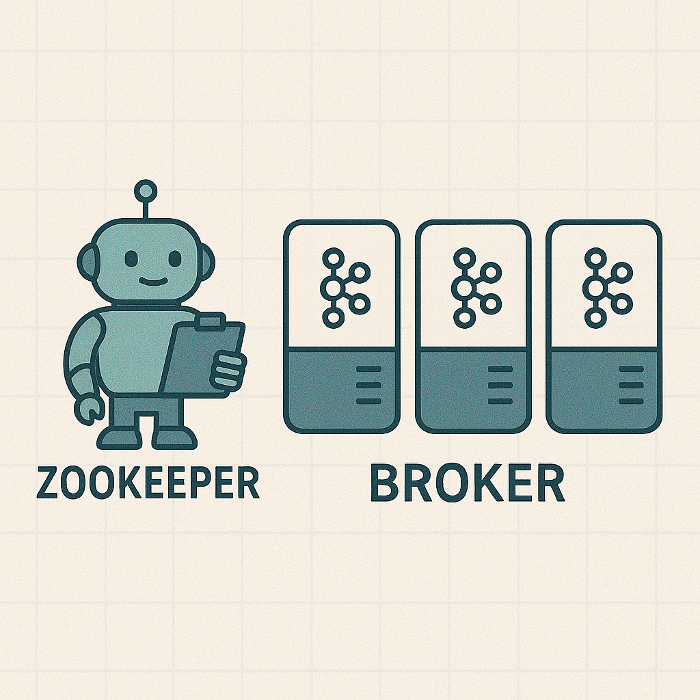
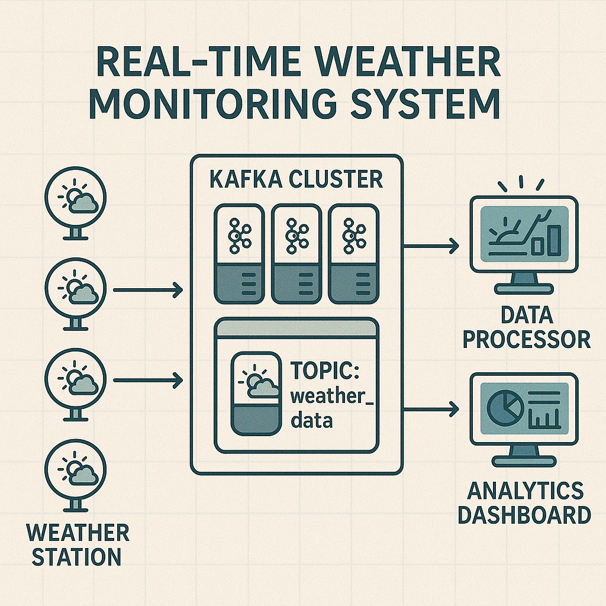

# Getting Started with Apache Kafka: A Hands-on Guide Through a Weather Monitoring System

## 1. Introduction

* **1.1. What is Apache Kafka?**

  * **The Official Definition:** According to the official Apache Kafka website, **"Apache Kafka is an open-source distributed event streaming platform used by thousands of companies for high-performance data pipelines, streaming analytics, data integration, and mission-critical applications."**
  * In essence, Kafka helps manage and process continuous flows of data (or "events") as they happen. It allows you to:

    * **Publish and subscribe to streams of records:** Think of this like sending out newsletters (publishing) and having people sign up to receive them (subscribing).
    * **Effectively store streams of records:** Kafka doesn't just pass messages along; it can store them reliably, often in the order they arrived.
    * **Process streams of records in real time:** This means you can analyze and react to the data almost as soon as it comes in.

    
  * **Our Simpler Take (Kafka as a Digital Post Office):** Now, let's break that down. Imagine Kafka as a super-efficient, digital post office designed specifically for data. Instead of letters and parcels, it handles streams of information (which we call data records or messages). It's built to be incredibly fast and can manage a massive flood of data coming from many different sources all at once, and distribute it to many destinations.
  * **Core Concepts (Simplified):**

    * **Broker:** Imagine a single post office branch. Kafka typically runs as a team (a "cluster") of one or more of these brokers (which are just servers). These brokers are responsible for receiving, storing, and handing out data messages.

    

    * **Topic:** This is like a specific mailbox or a category at the post office, dedicated to a particular type of information. For example, you might have a topic for "website_clicks," another for "temperature_sensor_readings," or in our project, "weather_data." Producers send messages to a specific topic, and consumers subscribe to topics to read those messages.

    

    * **Partition:** If a topic becomes very popular (gets a lot of messages), it can be divided into several "partitions." Think of this as having multiple service counters for the same popular mailbox. Each partition holds a sequence of messages, and this division allows Kafka to handle more data and lets multiple consumers read from the same topic simultaneously (each from a different partition), speeding things up. Messages within a partition are ordered.

    

    * **Producer:** These are your applications or services that write or send data *to* Kafka topics. In our weather project, the Python script that simulates weather stations generating data will be a producer. They're like the people dropping letters into a specific mailbox (topic).

    

    * **Consumer:** These are applications or services that read or subscribe to data *from* Kafka topics. In our project, a Python script that processes the incoming weather data will be a consumer. They're like people who have a subscription to pick up letters from a specific mailbox.

    

    * **Zookeeper (The Classic Helper):** Traditionally, Kafka used Zookeeper as its trusty administrative assistant or coordinator. Zookeeper helped manage the Kafka brokers, kept track of which broker was the leader for a partition, stored configurations, and generally ensured the whole Kafka cluster ran smoothly. (Important note: While newer versions of Kafka are moving towards removing the Zookeeper dependency with something called KRaft mode, many existing systems and Docker images, including the one we'll use for simplicity in this beginner tutorial, still rely on Zookeeper. So, you'll see it in our setup!)

    
  * **Why is Kafka a Big Deal?**

    * **Handles Tons of Data (Scalability):** Kafka can start small and grow to handle an enormous volume of messages – we're talking billions of messages a day, like at big companies such as Netflix or LinkedIn. You can add more brokers (post office branches) to the cluster as your data needs grow.
    * **Doesn't Lose Data Easily (Fault Tolerance & Durability):** Data in Kafka is typically written to disk and can be replicated (copied) across multiple brokers. So, if one broker (post office branch) has a problem and goes offline, another broker with a copy of the data can take over, and your messages aren't lost.
    * **Super Fast (Real-time Processing & Low Latency):** Kafka is designed for speed. Messages can be produced and consumed with very little delay (low latency), making it perfect for applications that need to react to information almost instantly.
    * **Decoupling Systems:** Producers don't need to know who the consumers are, and consumers don't need to know who the producers are. They only care about the Kafka topic. This "decoupling" makes systems more flexible and easier to maintain.
* **1.2. Real-World Use Cases (Where is Kafka Used?)**

  * Kafka is incredibly versatile. Here are a few common scenarios:
    * **Website Activity Tracking:** Imagine a busy e-commerce site. Kafka can capture every click, page view, search query, and item added to a cart in real-time. This data can then be used to personalize recommendations, analyze user behavior, or update inventory.
    * **Log Aggregation:** Modern applications often consist of many small services (microservices) running on different servers. Each service generates log files (recording what it's doing, any errors, etc.). Kafka can act as a central pipeline to collect all these logs from various sources and make them available for analysis, monitoring, and troubleshooting in one place.
    * **Real-time Analytics & Dashboards:** Companies use Kafka to feed live data into systems that perform calculations on the fly. For example, a financial institution might analyze streams of stock trades to detect market trends or a ride-sharing app might update driver locations and ETAs on a live map.
    * **Messaging System & Microservices Communication:** In complex applications built from many independent services (microservices), Kafka can serve as a reliable backbone for these services to communicate with each other. One service can produce an event (e.g., "new_order_placed"), and other interested services can consume this event to perform their tasks (e.g., update inventory, send a confirmation email).
    * **Internet of Things (IoT):** Devices like sensors, smart home appliances, and industrial machinery can generate a constant stream of data. Kafka is well-suited to ingest and process this high-volume IoT data.
* **1.3. Project Overview: The Real-Time Weather Monitoring System**

  * **The Goal:** For this tutorial, we're going to build a simplified version of a system that collects and processes weather data.
    * Imagine we have several automated weather stations (which will be simulated by our Python "producer" script). These stations are constantly measuring things like temperature, humidity, and wind speed.
    * These stations will send their readings as data messages to our Kafka "digital post office." Each message will be tagged for a specific topic, let's call it `weather_data`.
    * Then, we'll create another Python script (a "consumer") that subscribes to these `weather_data` reports. This consumer could, for example, just print the data, or in a more advanced scenario, it might store it in a database, display it on a dashboard, or trigger alerts if extreme weather is detected.
  * Here's a visual overview of what our mini-project will look like:

  

  * **What You Will Learn By Doing This Project:**
    * How to get a basic Kafka environment (a broker and its helper Zookeeper) up and running on your own computer using Docker. Docker is a tool that makes it much easier to run software like Kafka without a complicated manual installation.
    * How to write a simple Python program (a Kafka producer) that generates some sample weather data and sends it into a Kafka topic.
    * How to write another Python program (a Kafka consumer) that connects to Kafka, subscribes to the topic, and reads the weather data sent by the producer.
    * You'll also get a conceptual introduction to how you might start processing or analyzing this data as it flows through Kafka (this is the world of "stream processing").
* **1.4. Prerequisites (What You'll Need Before We Start)**

  * **Basic Python Knowledge:** You should be comfortable with fundamental Python concepts like variables, data types (strings, numbers, dictionaries), writing functions, and using loops. You don't need to be a Python guru, but a basic understanding will be very helpful.
  * **Docker and Docker Compose Installed:** We'll be using Docker to run Kafka and Zookeeper in "containers." Containers are like lightweight, self-contained packages for software. Docker makes setting up complex software like Kafka much simpler. Docker Compose is a tool that helps you manage multi-container Docker applications (like ours, which involves both Kafka and Zookeeper).
    * *If you don't have them, you'll need to install Docker Desktop (which includes Docker Compose) for your operating system (Windows, macOS, or Linux). We'll point you to the official installation guides in the setup section.*
  * **An IDE or Text Editor:** You'll need a program to write your Python code. Any code editor or Integrated Development Environment (IDE) you are comfortable with will do. Popular choices include:
    * Visual Studio Code (VS Code) - free, very popular.
    * PyCharm Community Edition - free, excellent for Python.
    * Sublime Text, Atom, or even simpler editors like Notepad++ (Windows) or Gedit (Linux) can work.
  * **Terminal or Command Prompt:** You'll need to use your computer's command-line interface to run Docker commands and execute your Python scripts.
    * On Windows, this is typically PowerShell or Command Prompt.
    * On macOS and Linux, it's usually called Terminal.

## 2. Phase 1: Foundations & Setup

Before we can send or receive any weather data with Kafka, we need to lay the groundwork. This phase covers setting up our project, getting Kafka running, and preparing our Python environment.

* **2.1. Project Initialization & Directory Structure**

  A well-organized project is easier to understand and manage. We've already created the basic structure for `Learn_Kafka`. Let's quickly review what each part is for:

  ```
  Learn_Kafka/                   # The main project root directory
  ├── docker/                    # Holds Docker-related files
  │   └── docker-compose.yml     # Defines how to run Kafka & Zookeeper with Docker
  ├── src/                       # Contains our Python source code
  │   ├── weather_producer/      # Code for our weather data producer
  │   │   └── producer.py        # The producer script
  │   ├── weather_consumer/      # Code for our weather data consumer
  │   │   └── consumer.py        # The consumer script
  │   └── weather_analytics/     # Code for basic data analytics (later phase)
  │       └── analytics.py       # The analytics script
  ├── requirements.txt           # Lists Python packages needed for the project
  ├── README.md                  # Provides an overview of the project
  └── docs/                      # For documentation and images
      ├── images/                # Where we store images for this article
      └── article.md             # This tutorial article you are reading!
  ```

  * **`docker/docker-compose.yml`**: This is a configuration file for Docker Compose, a tool that helps us run multi-container applications. We'll use it to easily start Kafka and its helper, Zookeeper.
  * **`src/`**: This directory is the heart of our application, containing all the Python scripts that will interact with Kafka.
    * `producer.py`: Will simulate weather stations sending data.
    * `consumer.py`: Will read and process that weather data.
    * `analytics.py`: (For a later phase) Will perform simple transformations or analyses on the data stream.
  * **`requirements.txt`**: This file tells Python's package manager, `pip`, which external libraries our project depends on (like the Kafka client library).
  * **`README.md`**: A standard file to give a quick summary of the project, how to set it up, and run it.
  * **`docs/`**: Contains this tutorial (`article.md`) and the helpful images (`images/`) we've been adding.

  If you haven't created this structure yet, now would be a good time to set up these directories and empty files.
* **2.2. Kafka & Zookeeper Setup with Docker**

  Getting Kafka running can sometimes be tricky due to its distributed nature. To make this super simple and ensure it works the same way for everyone, we'll use **Docker**.

  * **What are Docker and Docker Compose?**

    * **Docker:** Think of Docker as a tool that lets you package software (like Kafka) along with all its dependencies into a standardized unit called a "container." This container can then run on almost any computer, regardless of its operating system or other installed software. It's like having a mini, isolated computer just for Kafka.
    * **Docker Compose:** Kafka needs another service called Zookeeper to work (at least in the version we're using for this beginner guide). Docker Compose is a tool for defining and running applications that use multiple Docker containers. Our `docker-compose.yml` file tells Docker Compose how to set up and connect Kafka and Zookeeper.
  * **Installing Docker:**
    If you don't have Docker installed, you'll need to download and install **Docker Desktop** for your operating system (Windows, macOS, or Linux). It includes both Docker and Docker Compose.

    * Official Docker website: [https://www.docker.com/products/docker-desktop/](https://www.docker.com/products/docker-desktop/)
      Follow the installation instructions for your specific OS. Make sure Docker Desktop is running after installation.
  * **The `docker-compose.yml` File Explained:**
    The `Learn_Kafka/docker/docker-compose.yml` file is used by Docker Compose to define and run our Kafka and Zookeeper services. Here's a look at its contents:

    ```yaml
    version: '3.8' # Specifies the Docker Compose file format version

    services:      # Defines the services (containers) to run
      zookeeper:   # The Zookeeper service
        image: confluentinc/cp-zookeeper:7.6.0 # Docker image for Zookeeper
        hostname: zookeeper
        container_name: zookeeper              # Name for the Zookeeper container
        ports:
          - "2181:2181"                        # Maps host port 2181 to container port 2181
        environment:
          ZOOKEEPER_CLIENT_PORT: 2181          # Zookeeper client port
          ZOOKEEPER_TICK_TIME: 2000            # Zookeeper timing configuration

      broker:      # The Kafka broker service
        image: confluentinc/cp-server:7.6.0      # Docker image for Kafka (Confluent Server)
        hostname: broker
        container_name: broker                 # Name for the Kafka container
        ports:
          # Host port 29092 maps to container port 29092.
          # This is for the PLAINTEXT_HOST listener used by external clients (our Python scripts).
          - "29092:29092"
        depends_on:
          - zookeeper                          # Ensures Zookeeper starts before Kafka
        environment:
          KAFKA_BROKER_ID: 1                   # Unique ID for the Kafka broker
          KAFKA_ZOOKEEPER_CONNECT: 'zookeeper:2181' # How Kafka finds Zookeeper

          # Defines the listeners the Kafka broker will bind to within its container.
          # PLAINTEXT://0.0.0.0:9092 - For internal communication within the Docker network (e.g., broker-to-broker, controller-to-broker).
          # PLAINTEXT_HOST://0.0.0.0:29092 - For external clients (our Python scripts) connecting via the host machine.
          KAFKA_LISTENERS: PLAINTEXT://0.0.0.0:9092,PLAINTEXT_HOST://0.0.0.0:29092

          # Maps listener names (PLAINTEXT, PLAINTEXT_HOST) to security protocols. Both use PLAINTEXT.
          KAFKA_LISTENER_SECURITY_PROTOCOL_MAP: PLAINTEXT:PLAINTEXT,PLAINTEXT_HOST:PLAINTEXT

          # Defines how clients connect to Kafka. These are the addresses advertised by the broker.
          # PLAINTEXT://localhost:9092: For internal components (like the controller or other brokers if we had a cluster)
          #   to connect to this broker. 'localhost' here refers to 'localhost' *within the broker container*.
          # PLAINTEXT_HOST://localhost:29092: For external clients (our Python scripts running on the host machine)
          #   to connect to this broker. 'localhost' here refers to 'localhost' *on the host machine*.
          KAFKA_ADVERTISED_LISTENERS: PLAINTEXT://localhost:9092,PLAINTEXT_HOST://localhost:29092

          # Listener used for communication between brokers (and by the controller to the broker).
          KAFKA_INTER_BROKER_LISTENER_NAME: PLAINTEXT

          KAFKA_OFFSETS_TOPIC_REPLICATION_FACTOR: 1 # Required for a single-node cluster
          KAFKA_GROUP_INITIAL_REBALANCE_DELAY_MS: 0 # Speeds up consumer startup
          # Confluent-specific settings
          KAFKA_CONFLUENT_LICENSE_TOPIC_REPLICATION_FACTOR: 1
          KAFKA_CONFLUENT_BALANCER_TOPIC_REPLICATION_FACTOR: 1
          KAFKA_TRANSACTION_STATE_LOG_MIN_ISR: 1
          KAFKA_TRANSACTION_STATE_LOG_REPLICATION_FACTOR: 1
          # KAFKA_JMX_PORT: 9101 # Optional JMX settings for monitoring
          # KAFKA_JMX_HOSTNAME: localhost
    ```

    **Key things to note for beginners:**

    * **Docker Images:** We are using `confluentinc/cp-zookeeper:7.6.0` for Zookeeper and `confluentinc/cp-server:7.6.0` for the Kafka broker (Confluent Server includes Kafka).
    * **Service Name:** The Kafka service is named `broker`.
    * **Ports for `broker`:** The line `- "29092:29092"` means that port `29092` on your host machine (e.g., `localhost:29092`) is mapped to port `29092` inside the `broker` container. Port `29092` is the standard internal port Kafka listens on.
    * **`KAFKA_ADVERTISED_LISTENERS`:** This critical setting is `PLAINTEXT://localhost:9092,PLAINTEXT_HOST://localhost:29092`.
      * `PLAINTEXT://localhost:9092`: This is how Kafka identifies itself to other services *within* the Docker network (e.g., if you had other Docker containers needing to talk to Kafka). They can reach it using the service name `broker` on its internal port `29092`.
      * `PLAINTEXT_HOST://localhost:29092`: This is how our Python applications, running *outside* Docker on `localhost` (your main computer), will connect. They connect to `localhost:29092`, which Docker then forwards to port `29092` of the `broker` container.
    * **`KAFKA_ZOOKEEPER_CONNECT`**: This tells the Kafka broker how to find Zookeeper. It's set to `zookeeper:2181` because our Zookeeper service is named `zookeeper` in the Docker Compose file, and it listens on port `2181`.
  * **Starting Kafka and Zookeeper:**

    1. Open your terminal or command prompt.
    2. Navigate to the `Learn_Kafka/docker/` directory (where your `docker-compose.yml` file is located).

       ```bash
       cd path/to/your/Learn_Kafka/docker/
       ```
    3. Run the following command to start Kafka and Zookeeper in the background (`-d` for detached mode):

       ```bash
       docker-compose up -d
       ```

       Docker will now download the Zookeeper and Kafka images (if it's the first time you're running this or if the images aren't already on your system) and then start the containers.
  * **Verifying the Setup:**

    * You can check if the containers are running with:

      ```bash
      docker ps
      ```

      You should see two containers listed, one named `zookeeper` and one named `broker`, with their status as "Up".
    * To see the logs:

      ```bash
      docker-compose logs broker 
      # or
      docker-compose logs zookeeper
      ```

      For the `broker` service, look for messages indicating it has started successfully, like `[KafkaServer id=1] started`.
  * **Stopping Kafka and Zookeeper:**
    When you're done, from the `Learn_Kafka/docker/` directory:

    ```bash
    docker-compose down
    ```
* **2.3. Python Kafka Client Installation**

  To interact with Kafka from our Python scripts, we need a Kafka client library.

  * **Choosing `kafka-python`:**
    There are a few Python Kafka libraries available. We've chosen `kafka-python` for this tutorial because:

    * It's a pure Python client, meaning it generally doesn't require compiling C extensions, making installation easier across different operating systems.
    * It's widely used and well-documented, making it suitable for beginners.
      (Another popular and very performant option is `confluent-kafka-python`, which is a wrapper around a C library. It's excellent for high-performance needs but can sometimes be a bit trickier to install initially.)
  * **Setting Up a Python Virtual Environment (Highly Recommended!):**
    Before installing any Python packages for a project, it's a best practice to create a "virtual environment."

    * **Why?** A virtual environment provides an isolated space for your project's dependencies. This means that the packages you install for this Kafka project won't interfere with packages installed for other Python projects on your system (or system-wide Python packages), and vice-versa. It keeps things clean and avoids version conflicts.
    * **How to create one:**
      1. Open your terminal or command prompt.
      2. Navigate to the root of your `Learn_Kafka` project directory:

         ```bash
         cd path/to/your/Learn_Kafka/
         ```
      3. Create a virtual environment (a common name for it is `venv`):

         ```bash
         # For Python 3
         python3 -m venv venv 
         # Or if 'python' points to Python 3 on your system
         # python -m venv venv 
         ```

         This will create a `venv` folder in your project.
      4. **Activate the virtual environment:**

         * **On macOS and Linux:**

           ```bash
           source venv/bin/activate
           ```
         * **On Windows (Command Prompt):**

           ```bash
           venv\Scripts\activate.bat
           ```
         * **On Windows (PowerShell):**

           ```bash
           venv\Scripts\Activate.ps1 
           ```

           (You might need to set your execution policy: `Set-ExecutionPolicy Unrestricted -Scope Process` for PowerShell if it's your first time running scripts.)
           Once activated, you should see `(venv)` at the beginning of your terminal prompt, indicating the virtual environment is active. Any `pip install` commands will now install packages into this isolated environment.
  * **The `requirements.txt` File:**
    Our `Learn_Kafka/requirements.txt` file specifies the Python packages needed for this project. For `kafka-python`, we are using a specific version for consistency:

    ```
    kafka-python==2.2.6
    ```

    Using `==2.2.6` ensures that we are all using the same version of the `kafka-python` library, which helps in making the project behave predictably for everyone following this tutorial.
  * **Installing Dependencies:**
    With your virtual environment activated, from the `Learn_Kafka` root directory:

    ```bash
    pip install -r requirements.txt
    ```
  * **Deactivating the virtual environment:**
    When you're done working on the project, you can deactivate the virtual environment by simply typing:

    ```bash
    deactivate
    ```

    You'll need to reactivate it (`source venv/bin/activate` or `venv\Scripts\activate`) each time you start a new terminal session to work on this project.

With these steps, our foundation is set! We have:

1. A clear project structure.
2. A way to easily run Kafka (version 7.6.0) and Zookeeper (version 7.6.0) using Docker.
3. Our Python environment ready with `kafka-python` (version 2.2.6).

We are now truly ready to start interacting with Kafka by building our first producer.

## 3. Phase 2: Data Production - Simulating Weather Stations

Now that our Kafka environment is ready and our Python setup is complete, it's time to start producing some data! In this phase, we'll simulate weather stations sending their readings to Kafka.

* **3.1. Designing the Weather Data Model**

  Before we write any producer code, we need to decide on the structure of the data our weather stations will send. A clear and consistent data model is crucial for any data pipeline.

  * **Data Format: JSON**
    We'll use **JSON (JavaScript Object Notation)** as the format for our messages. JSON is a lightweight, human-readable, and widely supported data interchange format, making it an excellent choice for Kafka messages.
  * **Data Fields**
    Each weather data message will contain the following information:

    * `station_id` (string): A unique identifier for the weather station sending the data. For example, `"station_A"`, `"station_B92"`.
    * `timestamp` (string): The date and time when the reading was taken. We'll use the ISO 8601 format, which is a standard way to represent dates and times (e.g., `"2023-10-27T14:35:22Z"`). The `Z` indicates UTC (Coordinated Universal Time).
    * `temperature` (float): The temperature reading in degrees Celsius (e.g., `25.5`).
    * `humidity` (float): The relative humidity as a percentage (e.g., `62.3` for 62.3%).
    * `wind_speed` (float): The wind speed in kilometers per hour (km/h) (e.g., `15.7`).
  * **Example JSON Message**
    Here's an example of what a single weather data message sent to Kafka will look like:

    ```json
    {
      "station_id": "station_alpha_7",
      "timestamp": "2024-01-15T10:30:00Z",
      "temperature": 18.5,
      "humidity": 70.2,
      "wind_speed": 12.3
    }
    ```

    This structure is simple yet provides enough detail for our weather monitoring system.
* **3.2. Implementing the Weather Data Producer (`src/weather_producer/producer.py`)**

  With our data model defined, let's write the Python script that will act as our weather station, generating data and sending it to Kafka. This script will be located at `src/weather_producer/producer.py`.

  First, we'll cover the essential parts: connecting to Kafka, preparing data, and sending messages.

  * **Connecting to Kafka**

    To send messages to Kafka, we need to:

    1. Import the `KafkaProducer` class from the `kafka.producer` module.
    2. Import other necessary Python libraries: `json` (to convert our data to JSON strings), `time` (to control the rate of message sending), `random` (to generate sample weather data), and `datetime` from the `datetime` module (to create timestamps).
    3. Create an instance of `KafkaProducer`, telling it where our Kafka broker is running (the `bootstrap_servers`).
    4. Specify a `value_serializer`. Kafka messages are sent as bytes. Since our weather data is in JSON format, we need to tell the producer how to convert our Python dictionary (representing the JSON object) into a byte string. We do this by first serializing the dictionary to a JSON string, and then encoding that string to UTF-8 bytes.

    Here's how the initial part of `src/weather_producer/producer.py` will look:

    ```python
    # src/weather_producer/producer.py

    import json
    import time
    import random
    from datetime import datetime, timezone # Added timezone
    from kafka.producer import KafkaProducer
    from kafka.errors import KafkaError # Added KafkaError for specific exception handling

    # Kafka broker address
    BOOTSTRAP_SERVERS = 'localhost:29092'

    # Kafka topic to produce messages to
    WEATHER_TOPIC = 'weather_data'

    # Number of messages to send per station in this run, then exit
    # Set to 0 or a negative number to run indefinitely until Ctrl+C
    MESSAGES_PER_STATION_LIMIT = 5 

    def create_producer():
        """Creates and returns a KafkaProducer instance."""
        try:
            producer = KafkaProducer(
                bootstrap_servers=[BOOTSTRAP_SERVERS],
                value_serializer=lambda v: json.dumps(v).encode('utf-8'),
                key_serializer=lambda k: k.encode('utf-8'), # Added key_serializer
                request_timeout_ms=60000 # Increased timeout for robust metadata fetching
            )
            print("Kafka Producer created successfully.")
            return producer
        except KafkaError as e: # More specific exception
            print(f"Error creating Kafka Producer: {e}")
            return None

    def generate_weather_data(station_id: str) -> dict:
        """Generates a sample weather data point."""
        return {
            "station_id": station_id,
            "timestamp": datetime.now(timezone.utc).isoformat(), # Use timezone-aware UTC time
            "temperature": round(random.uniform(-5.0, 35.0), 1),  # Celsius
            "humidity": round(random.uniform(20.0, 100.0), 1),   # Percentage
            "wind_speed": round(random.uniform(0.0, 75.0), 1)    # km/h
        }

    def on_send_success(record_metadata):
        """Callback for successful message sending."""
        print(f"Message sent to topic '{record_metadata.topic}', partition {record_metadata.partition}, offset {record_metadata.offset}")

    def on_send_error(excp):
        """Callback for failed message sending."""
        print(f"Error sending message: {excp}")

    if __name__ == "__main__":
        producer = create_producer()

        if producer:
            station_ids = ["station_alpha", "station_bravo", "station_charlie"]
            messages_sent_count = {station_id: 0 for station_id in station_ids}

            print("Producer instance created. Waiting 15 seconds for broker to initialize fully...")
            time.sleep(15) # Wait for broker to be ready, especially in Docker

            print(f"Starting to produce messages to topic: {WEATHER_TOPIC} on {BOOTSTRAP_SERVERS}")
            print(f"Will send {MESSAGES_PER_STATION_LIMIT} messages per station (if > 0), then exit. Press Ctrl+C to stop early.")

            try:
                while True:
                    all_stations_reached_limit = True
                    for station_id in station_ids:
                        if MESSAGES_PER_STATION_LIMIT > 0 and messages_sent_count[station_id] >= MESSAGES_PER_STATION_LIMIT:
                            continue # Skip this station if its limit is reached
                        all_stations_reached_limit = False # At least one station is still sending

                        weather_data = generate_weather_data(station_id)
                        print(f"Sending: {weather_data}")

                        # Send the message, key is station_id, value is the weather data
                        future = producer.send(
                            WEATHER_TOPIC,
                            key=station_id, # Will be serialized by key_serializer
                            value=weather_data
                        )
                        # Add callbacks for success or failure
                        future.add_callback(on_send_success)
                        future.add_errback(on_send_error)

                        messages_sent_count[station_id] += 1

                    if MESSAGES_PER_STATION_LIMIT > 0 and all_stations_reached_limit:
                        print(f"All stations reached the message limit of {MESSAGES_PER_STATION_LIMIT}. Exiting loop.")
                        break 

                    # Wait a bit before sending the next batch of readings
                    time.sleep(random.uniform(1, 3)) 

            except KeyboardInterrupt:
                print("\nGracefully shutting down producer due to Ctrl+C...")
            except Exception as e:
                print(f"An unexpected error occurred: {e}")
            finally:
                if producer:
                    print("Flushing remaining messages...")
                    producer.flush() # Ensure all buffered messages are sent
                    print("Closing producer.") # Added this print statement
                    producer.close()
                    print("Producer closed.")
        else:
            print("Producer could not be created. Exiting.")
    ```

    **Code Walkthrough:**

    * We've added `timezone` from `datetime` and `KafkaError` for more specific error handling.
    * `MESSAGES_PER_STATION_LIMIT`: A new constant to control how many messages each station sends before the script automatically stops. This is useful for testing.
    * `request_timeout_ms=60000`: In `create_producer()`, this timeout is increased. While our main fix was listener configuration, this can help in environments where the broker might be slow to respond initially.
    * **`create_producer()`**: Now includes `key_serializer=lambda k: k.encode('utf-8')` because our message keys (`station_id`) are strings and need to be encoded to bytes.
    * **`generate_weather_data()`**: Now uses `datetime.now(timezone.utc).isoformat()` to ensure timestamps are timezone-aware (UTC) and in standard ISO 8601 format.
    * **`on_send_success` and `on_send_error`**: These are our callback functions.
    * **Main Block (`if __name__ == "__main__"`)**:
      * `time.sleep(15)`: A 15-second pause is added after creating the producer to give the Kafka broker (especially when running in Docker) ample time to initialize before the producer starts sending messages.
      * It initializes a `messages_sent_count` dictionary to keep track of how many messages each station has sent.
      * The main `while True` loop continues until `MESSAGES_PER_STATION_LIMIT` is reached for all stations (if the limit is positive) or until the user presses Ctrl+C.
      * Inside the loop, for each `station_id`:
        * It generates data using `generate_weather_data()`.
        * `producer.send(WEATHER_TOPIC, key=station_id, value=weather_data)` sends the message. The `key` is the `station_id` (which gets encoded to bytes by our `key_serializer`), and the `value` is the `weather_data` dictionary (which gets JSON serialized and then byte-encoded by our `value_serializer`).
        * `future.add_callback(...)` and `future.add_errback(...)` attach our defined callback functions to the send operation.
      * A `time.sleep(random.uniform(1, 3))` introduces a small, variable delay.
      * The `try...except KeyboardInterrupt...finally` block ensures that if the loop is exited (either by reaching the message limit, by Ctrl+C, or due to an unexpected error), the producer flushes any pending messages and closes the connection cleanly.

This script now provides a more complete example of a Kafka producer, capable of sending structured data with keys, handling send results, and shutting down properly.

* **3.3. Running the Producer and Verifying Data**

  Now that we have our `producer.py` script, let's run it and see our weather data flowing into Kafka!

  1. **Start the Kafka Environment (if not already running):**
     Open your terminal, navigate to the `Learn_Kafka/docker/` directory, and run:

     ```bash
     docker-compose up -d
     ```

     Wait a few moments for the Zookeeper and Kafka broker containers to start up. You can check their status with `docker ps`.
  2. **Activate Your Python Virtual Environment and Run the Producer:**
     Open a new terminal window or tab. Navigate to the root of your `Learn_Kafka` project directory.

     * **Activate the virtual environment:**

       * On macOS and Linux: `source venv/bin/activate`
       * On Windows (Command Prompt): `venv\Scripts\activate.bat`
       * On Windows (PowerShell): `venv\Scripts\Activate.ps1`
     * **Run the producer script:**
       Once the virtual environment is active, run the producer:

       ```bash
       python src/weather_producer/producer.py
       ```

     You should see output in your terminal indicating that the producer has connected and is starting to send messages. It will print the data being sent and the success/failure callbacks, similar to this (the order and specific metadata might vary slightly):

     ```
     Kafka Producer created successfully.
     Starting to produce messages to topic: weather_data on localhost:29092
     Will send 5 messages per station (if > 0), then exit. Press Ctrl+C to stop early.
     Sending: {'station_id': 'station_alpha', 'timestamp': '2024-01-15T12:34:56.789012+00:00', 'temperature': 23.5, 'humidity': 60.1, 'wind_speed': 10.2}
     Message sent to topic 'weather_data', partition 0, offset 0
     Sending: {'station_id': 'station_bravo', 'timestamp': '2024-01-15T12:34:56.789912+00:00', 'temperature': 15.8, 'humidity': 75.5, 'wind_speed': 5.3}
     Message sent to topic 'weather_data', partition 0, offset 1
     ...
     ```

     The script will send 5 messages per station and then exit, or you can stop it earlier by pressing `Ctrl+C`.
  3. **Verify Data in Kafka using `kafka-console-consumer`:**
     To see the messages as they arrive in the `weather_data` topic, we can use the `kafka-console-consumer` command-line tool. This tool is available inside our Kafka broker container.

     Open a **new terminal window** (leave the producer running if you set `MESSAGES_PER_STATION_LIMIT` to 0 or a high number, or run the producer again if it has finished).

     Execute the following `docker exec` command. This command tells Docker to run `kafka-console-consumer` *inside* our running `broker` container:

     ```bash
     docker exec -it broker kafka-console-consumer --bootstrap-server localhost:9092 --topic weather_data --from-beginning --property print.key=true --property key.deserializer=org.apache.kafka.common.serialization.StringDeserializer
     ```

     **Explanation of the command:**

     * `docker exec -it broker`: Tells Docker to execute a command inside the container named `broker` in interactive mode (`-it`).
     * `kafka-console-consumer`: The script to run.
     * `--bootstrap-server localhost:9092`: Specifies the Kafka broker to connect to *from within the Docker network*. Inside the `broker` container, `localhost:9092` refers to itself.
     * `--topic weather_data`: The topic to consume messages from.
     * `--from-beginning`: Tells the consumer to read all messages in the topic from the very beginning. If you omit this, you'll only see new messages that arrive after you start the consumer.
     * `--property print.key=true`: This tells the console consumer to print the message key along with the value.
     * `--property key.deserializer=org.apache.kafka.common.serialization.StringDeserializer`: Since our keys are strings (`station_id`), we tell the consumer to use a string deserializer to interpret the key bytes correctly for printing.

     You should now see the JSON messages produced by `producer.py` appearing in this terminal. Each message will be preceded by its key (the `station_id`):

     ```
     station_alpha   {"station_id": "station_alpha", "timestamp": "2024-01-15T12:34:56.789012+00:00", "temperature": 23.5, "humidity": 60.1, "wind_speed": 10.2}
     station_bravo   {"station_id": "station_bravo", "timestamp": "2024-01-15T12:34:56.789912+00:00", "temperature": 15.8, "humidity": 75.5, "wind_speed": 5.3}
     ...
     ```

     Press `Ctrl+C` in the `kafka-console-consumer` terminal to stop it.

     **(Alternative Tool: `kcat` - formerly `kafkacat`)**
     If you have `kcat` installed on your host machine, it's a very powerful command-line utility for Kafka. You could connect directly to `localhost:29092` (the port mapped to your host):

     ```bash
     # Example kcat command (if installed locally)
     # kcat -b localhost:29092 -t weather_data -C -K: -f 'Key: %k\nValue: %s\n\n'
     ```

     For this tutorial, we'll stick to `kafka-console-consumer` via `docker exec` as it doesn't require extra local installations.

With messages successfully produced and verified in the topic, Phase 2 is complete! We have a working data pipeline feeding weather information into our Kafka cluster.

## 4. Phase 3: Data Consumption - Processing Weather Reports

Now that we have weather data flowing into our Kafka topic, the next step is to build a consumer that can read and process this information. This phase focuses on creating a Python script that subscribes to the `weather_data` topic, retrieves the messages, and makes sense of them.

* **4.1. Implementing the Weather Data Consumer (`src/weather_consumer/consumer.py`)**

  Our consumer script, `src/weather_consumer/consumer.py`, will connect to Kafka, listen for new messages on the `weather_data` topic, and then process them (for now, by printing them to the console).

  * **Connecting to Kafka & Deserializing Data**

    To read messages, we need to:

    1. Import the `KafkaConsumer` class from `kafka.consumer`.
    2. Import `json` for deserializing the message value.
    3. Create an instance of `KafkaConsumer`.
       * Provide the topic name(s) we want to subscribe to (in our case, `WEATHER_TOPIC`).
       * Specify the `bootstrap_servers` so the consumer knows where to find Kafka.
       * **`value_deserializer`**: This is the inverse of the producer's `value_serializer`. The consumer receives messages as raw bytes. We need to tell it how to convert these bytes back into a usable Python dictionary. Since our producer sent JSON strings encoded as UTF-8, the deserializer will first decode the bytes to a UTF-8 string, and then parse that string as JSON.
       * **`key_deserializer`**: Similarly, since our producer sent keys encoded as UTF-8 bytes, we need to tell the consumer how to decode these bytes back into a string.

    Here's the initial setup for `src/weather_consumer/consumer.py`:

    ```python
    # src/weather_consumer/consumer.py

    import json
    from kafka.consumer import KafkaConsumer
    from kafka.errors import KafkaError

    # Kafka broker address - should match producer
    BOOTSTRAP_SERVERS = 'localhost:29092'

    # Kafka topic to consume messages from - should match producer
    WEATHER_TOPIC = 'weather_data'

    def create_consumer(topic_name, bootstrap_servers):
        """Creates and returns a KafkaConsumer instance."""
        print(f"Subscribing to topic: {topic_name}")
        try:
            consumer = KafkaConsumer(
                topic_name,
                bootstrap_servers=bootstrap_servers,
                # Decode UTF-8 bytes to string, then parse JSON string to dict
                value_deserializer=lambda v_bytes: json.loads(v_bytes.decode('utf-8')),
                # Decode UTF-8 bytes to string for the key
                key_deserializer=lambda k_bytes: k_bytes.decode('utf-8'),
                # Other important configurations will be added here later
            )
            print("Kafka Consumer created successfully.")
            return consumer
        except KafkaError as e:
            print(f"Error creating Kafka Consumer: {e}")
            return None

    if __name__ == "__main__":
        consumer = create_consumer(WEATHER_TOPIC, BOOTSTRAP_SERVERS)

        if consumer:
            # We will add message processing logic here later
            print("Waiting for messages...")
            # consumer.close() # Close consumer when done (handle better later)
            pass # Placeholder
    ```

    **Explanation:**

    * `KafkaConsumer(WEATHER_TOPIC, ...)`: We pass the topic name directly to the constructor to subscribe to it upon creation.
    * `value_deserializer=lambda v_bytes: json.loads(v_bytes.decode('utf-8'))`: This lambda function first takes the incoming bytes (`v_bytes`), decodes them from UTF-8 into a string, and then `json.loads()` parses that JSON string into a Python dictionary.
    * `key_deserializer=lambda k_bytes: k_bytes.decode('utf-8')`: This lambda function takes the incoming key bytes (`k_bytes`) and decodes them from UTF-8 into a string.
    * The `create_consumer` function now handles basic error scenarios during consumer creation.
  * **Consumer Groups and Offset Management**

    Two important concepts for Kafka consumers are "Consumer Groups" and "Offset Management."

    * **`group_id` (Consumer Group):**
      When creating a `KafkaConsumer`, you must specify a `group_id`. This ID identifies the consumer group this consumer instance belongs to.

      * **Purpose:** Consumer groups are Kafka's way of allowing a group of consumer processes to divide the work of processing records from topics. Each partition of a topic is consumed by exactly one consumer instance within each subscribing consumer group.
      * **Scalability & Parallelism:** If you run multiple instances of your consumer script with the same `group_id`, Kafka will automatically distribute the topic partitions among them. For example, if a topic has 4 partitions and you run 4 consumer instances in the same group, each instance will handle one partition. If you run 2 instances, each might handle 2 partitions. This allows you to scale out your consumption.
      * **Fault Tolerance:** If one consumer instance in a group fails, Kafka will trigger a rebalance, and its assigned partitions will be reassigned to other active consumers in the same group.
        In our script, we define `CONSUMER_GROUP_ID = 'weather-report-group-1'`.
    * **`auto_offset_reset` (Offset Management):**
      Kafka keeps track of which messages a consumer group has already read by storing "offsets." An offset is like a bookmark for each partition, indicating the position of the next message to be consumed.
      The `auto_offset_reset` parameter tells the consumer what to do if it starts up and finds that there's no committed offset for its group for a particular partition (e.g., it's the first time this group is consuming from the topic, or the previously committed offset is no longer valid).

      * `'earliest'`: The consumer will start reading from the very first message (the earliest offset) available in the partition.
      * `'latest'` (Default): The consumer will start reading only new messages that arrive after it starts (from the latest offset).
      * `'none'`: The consumer will throw an exception if no previous offset is found.
        For our tutorial, we set `AUTO_OFFSET_RESET = 'earliest'`. This means if you stop and restart the consumer (and it's part of a new or reset group, or if offsets weren't properly committed/retained from a previous run), it will try to read all existing messages in the topic from the beginning. This is useful for development and testing to ensure we see all data.
    * **Offset Committing (Simplified):**
      By default, the `kafka-python` consumer uses an auto-commit mechanism (`enable_auto_commit=True` by default). It periodically commits the offsets of messages that have been successfully returned by the poll loop. This is convenient for simple use cases. For more critical applications where you need precise control over when a message is considered "processed" (e.g., after it's successfully written to a database), you would disable auto-commit and manually commit offsets using `consumer.commit()`.
  * **Fetching and Processing Messages**

    Once the consumer is created and connected, it continuously polls Kafka for new messages.

    * **The Message Loop:** The `for message in consumer:` loop in our `consume_messages` function is a blocking call. It will wait for messages to arrive and then iterate through them one by one.
    * **Message Attributes:** Each `message` object retrieved from the consumer provides several useful attributes:
      * `message.topic` (str): The topic the message came from.
      * `message.partition` (int): The partition within the topic.
      * `message.offset` (int): The offset of the message within its partition.
      * `message.key`: The message key (deserialized by our `key_deserializer`).
      * `message.value`: The message payload (deserialized by our `value_deserializer` into a Python dictionary).
      * `message.timestamp` (int): The message timestamp (usually in milliseconds since the epoch). We convert this to a human-readable `datetime` object.
      * `message.timestamp_type` (int): Indicates if the timestamp is from message creation time or log append time.
    * **Processing:** In our example, we simply print these attributes and then try to extract `station_id` and `temperature` from the `message.value` dictionary for a simple processed output.
  * **Graceful Shutdown**

    Just like with the producer, it's important to close the consumer when it's no longer needed.

    * `consumer.close()`: This releases resources and ensures the consumer leaves the consumer group cleanly, which can trigger a rebalance if other consumers in the group are still active.
    * We use a `try...except KeyboardInterrupt...finally` block in `consume_messages`. If the user presses `Ctrl+C`, the `KeyboardInterrupt` is caught, a message is printed, and the `finally` block ensures `consumer.close()` is called.
    * The `finally` block also catches other potential exceptions during consumption.
  * **Complete Consumer Script and Walkthrough**

    Let's look at the complete `src/weather_consumer/consumer.py` script with these concepts integrated:

    ```python
    # src/weather_consumer/consumer.py

    import json
    from datetime import datetime # For converting timestamp
    from kafka.consumer import KafkaConsumer
    from kafka.errors import KafkaError

    # Kafka broker address - should match producer
    BOOTSTRAP_SERVERS = 'localhost:29092'

    # Kafka topic to consume messages from - should match producer
    WEATHER_TOPIC = 'weather_data'

    # Consumer group ID
    CONSUMER_GROUP_ID = 'weather-report-group-1'

    # Offset reset policy
    AUTO_OFFSET_RESET = 'earliest'

    def create_consumer(topic_name, bootstrap_servers, group_id, auto_offset_reset_config):
        """Creates and returns a KafkaConsumer instance."""
        print(f"Subscribing to topic: {topic_name} as group: {group_id} with auto_offset_reset='{auto_offset_reset_config}'")
        try:
            consumer = KafkaConsumer(
                topic_name, # Topic to subscribe to
                bootstrap_servers=bootstrap_servers,
                group_id=group_id, # Identifier for the consumer group
                auto_offset_reset=auto_offset_reset_config, # Policy for where to begin reading if no offset is committed
                # Decode UTF-8 bytes to string, then parse JSON string to dict for the value
                value_deserializer=lambda v_bytes: json.loads(v_bytes.decode('utf-8')),
                # Decode UTF-8 bytes to string for the key
                key_deserializer=lambda k_bytes: k_bytes.decode('utf-8')
            )
            print("Kafka Consumer created successfully.")
            return consumer
        except KafkaError as e:
            print(f"Error creating Kafka Consumer: {e}")
            return None

    def consume_messages(consumer):
        """Continuously polls for messages and processes them."""
        if not consumer:
            print("Consumer instance is None. Cannot consume messages.")
            return

        print("Waiting for messages... (Press Ctrl+C to stop)")
        try:
            for message in consumer: # This loop will block and wait for new messages
                print(f"\n--- New Message --- Topic: {message.topic}, Partition: {message.partition}, Offset: {message.offset} ---")
                try:
                    # Attempt to access and print message attributes
                    print(f"  Timestamp: {datetime.fromtimestamp(message.timestamp / 1000)}") # Convert ms to datetime
                    print(f"  Key: {message.key}")
                    print(f"  Value (raw dict): {message.value}")

                    # Example: Simple processing - access specific fields from the weather data
                    if isinstance(message.value, dict):
                        station_id = message.value.get('station_id')
                        temperature = message.value.get('temperature')
                        humidity = message.value.get('humidity')
                        if station_id and temperature is not None:
                            print(f"  >> Processed Weather Update: Station {station_id} - Temp: {temperature}°C, Humidity: {humidity}%")
                        else:
                            print("  >> Note: Message value is a dict, but 'station_id' or 'temperature' missing.")
                    else:
                        # This case should ideally not happen if deserialization is correct
                        # and producer sends valid JSON dicts.
                        print(f"  >> Warning: Message value is not a dictionary. Type: {type(message.value)}")

                except Exception as e:
                    # Handle errors that might occur during processing of a single message
                    print(f"Error processing individual message (Offset: {message.offset}): {e}")
                    # Optionally, you might want to log the problematic message or take other actions

        except KeyboardInterrupt:
            print("\nConsumer interrupted by user (Ctrl+C).")
        except json.JSONDecodeError as e:
            # This error would typically be caught by the value_deserializer, 
            # but good to have as a general catch if malformed data somehow gets through
            # or if the deserializer itself fails.
            print(f"Critical error decoding JSON for a message: {e}") 
        except KafkaError as e:
            print(f"A Kafka-specific error occurred during consumption: {e}")
        except Exception as e:
            print(f"An unexpected error occurred while consuming messages: {e}")
        finally:
            print("Closing Kafka Consumer...")
            if consumer:
                consumer.close() # This is crucial for graceful shutdown and rebalancing
            print("Kafka Consumer closed.")

    if __name__ == "__main__":
        consumer_instance = create_consumer(
            WEATHER_TOPIC, 
            BOOTSTRAP_SERVERS, 
            CONSUMER_GROUP_ID, 
            AUTO_OFFSET_RESET
        )

        if consumer_instance:
            consume_messages(consumer_instance)
        else:
            print("Could not create consumer instance. Exiting.")
    ```

    **Code Walkthrough Highlights:**

    * **Constants:** `CONSUMER_GROUP_ID` and `AUTO_OFFSET_RESET` are defined at the top.
    * **`create_consumer()`**: Takes `group_id` and `auto_offset_reset_config` as arguments and passes them to the `KafkaConsumer` constructor.
    * **`consume_messages()`**:
      * The `for message in consumer:` loop is the heart of the consumption process.
      * Inside the loop, we print various attributes of the `message`.
      * We explicitly convert `message.timestamp` (which is in milliseconds) to a more readable `datetime` object.
      * A basic processing step attempts to extract `station_id`, `temperature`, and `humidity` from the `message.value` (which should be a dictionary thanks to our deserializer).
      * Added more specific error handling within the message processing loop and for `KafkaError` during general consumption.
    * **`if __name__ == "__main__":`**: Calls `create_consumer` with the defined constants and then passes the created consumer to `consume_messages`.

This consumer is now set up to join a specific group, read messages from the beginning of the topic (if it's a new group or has no committed offsets), deserialize JSON data, process it simply, and shut down cleanly.

* **4.2. Running the Consumer**

  With our `consumer.py` script ready, let's put it into action and see it process the weather data messages sent by our producer.

  1. **Ensure the Producer is Running (or Has Sent Data):**
     For the consumer to have messages to process, our `producer.py` script needs to be running and sending data to the `weather_data` topic, or it should have run recently so that messages are already in the topic (remember we set `auto_offset_reset='earliest'` for the consumer).

     * If your producer is set to send a limited number of messages (like our default `MESSAGES_PER_STATION_LIMIT = 5`) and has already finished, you might want to run it again or temporarily set `MESSAGES_PER_STATION_LIMIT` to `0` or a negative number in `src/weather_producer/producer.py` to have it run continuously while you test the consumer.
     * If you choose to run it continuously, start `producer.py` in one terminal window (don't forget to activate your virtual environment: `source venv/bin/activate` or `venv\Scripts\activate`, then `python src/weather_producer/producer.py`).
  2. **Activate Your Python Virtual Environment and Run the Consumer:**
     Open a **new terminal window or tab** (separate from the producer if it's running continuously). Navigate to the root of your `Learn_Kafka` project directory.

     * **Activate the virtual environment** (if not already active in this terminal):

       * On macOS and Linux: `source venv/bin/activate`
       * On Windows (Command Prompt): `venv\Scripts\activate.bat`
       * On Windows (PowerShell): `venv\Scripts\Activate.ps1`
     * **Run the consumer script:**

       ```bash
       python src/weather_consumer/consumer.py
       ```
  3. **Observing the Consumer Output:**
     Once the consumer starts, it will connect to Kafka, subscribe to the `weather_data` topic as part of the `weather-report-group-1` consumer group, and begin fetching messages. You should see output similar to this (the exact order, timestamps, and random data will vary):

     ```
     Subscribing to topic: weather_data as group: weather-report-group-1 with auto_offset_reset='earliest'
     Kafka Consumer created successfully.
     Waiting for messages... (Press Ctrl+C to stop)

     --- New Message --- Topic: weather_data, Partition: 0, Offset: 0 ---
       Timestamp: 2024-01-15 12:34:56.789012
       Key: station_alpha
       Value (raw dict): {'station_id': 'station_alpha', 'timestamp': '2024-01-15T12:34:56.789012+00:00', 'temperature': 23.5, 'humidity': 60.1, 'wind_speed': 10.2}
       >> Processed Weather Update: Station station_alpha - Temp: 23.5°C, Humidity: 60.1%

     --- New Message --- Topic: weather_data, Partition: 0, Offset: 1 ---
       Timestamp: 2024-01-15 12:34:56.789912
       Key: station_bravo
       Value (raw dict): {'station_id': 'station_bravo', 'timestamp': '2024-01-15T12:34:56.789912+00:00', 'temperature': 15.8, 'humidity': 75.5, 'wind_speed': 5.3}
       >> Processed Weather Update: Station station_bravo - Temp: 15.8°C, Humidity: 75.5%
     ...
     ```

     The consumer will continue to print messages as they are produced. Press `Ctrl+C` in the consumer's terminal to stop it.
  4. **Experimenting with Multiple Consumer Instances (Simulating Scalability):**
     One of the key benefits of Kafka's consumer groups is the ability to scale out processing by running multiple instances of your consumer.

     * **Start a Second Consumer Instance:**
       Keep your first consumer instance running in its terminal. Open a **third terminal window/tab**. Activate the virtual environment again, navigate to the `Learn_Kafka` project root, and run the *same* `consumer.py` script:
       ```bash
       python src/weather_consumer/consumer.py
       ```
     * **Observation:**
       You'll notice that this second consumer also joins the `weather-report-group-1` group.
       * **If your `weather_data` topic only has one partition** (which is common for auto-created topics in a single-broker setup like ours): Only *one* of the consumer instances will actively receive and process messages at any given time. The other consumer will remain connected but idle. If you stop the active consumer (e.g., with `Ctrl+C`), Kafka will trigger a rebalance, and the previously idle consumer will take over processing new messages (and any uncommitted messages if applicable).
       * **How it relates to parallelism:** For true parallel processing where multiple consumer instances within the *same group* process data simultaneously, the topic they are consuming from must have multiple partitions. Kafka would then assign different partitions to different consumer instances within the group. For example, if `weather_data` had 3 partitions, and you ran 3 consumers in the same group, each might get one partition.
       * **Why this is still useful:** Even with a single partition, running a second instance demonstrates fault tolerance. If one consumer crashes, the other can take over. For a production system, you'd typically ensure your topics have enough partitions to match your desired level of consumer parallelism.

     You can stop both consumer instances with `Ctrl+C` in their respective terminals when you're done experimenting.

This successfully demonstrates how to run our Kafka consumer, observe its output, and conceptually understand how consumer groups enable scaling and fault tolerance.

## 5. Phase 4: Basic Stream Processing with Kafka (Conceptual)

So far, we've successfully produced weather data into Kafka and consumed it. But often, you don't just want to read data; you want to *process* it as it arrives – transform it, analyze it, or react to it in real-time. This is where stream processing comes in.

While Kafka itself is the backbone for storing and transporting event streams, other tools and libraries work with Kafka to perform the actual processing. This phase will conceptually introduce how you might approach a simple analytics task with the data flowing through our system.

* **5.1. Introduction to Kafka Streams (High-Level)**

  * **What is Kafka Streams?**
    Kafka Streams is a client library provided by Apache Kafka for building applications and microservices where the input and/or output data is stored in Kafka clusters. It allows you to perform stateful or stateless processing of data streams directly within your Java or Scala applications (it's primarily a JVM-based library).

    Key characteristics of Kafka Streams include:

    * **Client Library:** It's not a separate processing cluster to manage. You simply include it as a library in your application. Your application instances then become stream processors.
    * **Scalability & Fault Tolerance:** It leverages Kafka's partitioning model and consumer groups for scalability and fault tolerance.
    * **Rich DSL:** It offers a high-level Domain-Specific Language (DSL) for common stream operations like `map`, `filter`, `join`, `windowing`, and aggregations, as well as a lower-level Processor API for more complex custom logic.
    * **Stateful Processing:** It has robust support for managing local state (e.g., for aggregations or joins) with fault tolerance via Kafka's changelog topics.
  * **Alternatives for Stream Processing with Kafka:**
    While Kafka Streams is a powerful option (especially for JVM-based applications), it's not the only way to process data from Kafka:

    * **Simple Consumer-Producer Pattern:** For straightforward transformations or stateless processing (like what we'll aim for in this project), you can write a Kafka consumer that reads messages from one topic, performs some logic, and then uses a Kafka producer to write the results to another topic. This is a very common and flexible approach.
    * **Other Stream Processing Frameworks:** Libraries and frameworks like [Faust](https://faust.readthedocs.io/) (Python), [Flink](https://flink.apache.org/), or [Spark Streaming](https://spark.apache.org/streaming/) can also integrate with Kafka as a data source and sink for more complex stream processing tasks, often providing their own execution engines and higher-level abstractions.
  * **Focus for Our Project:**
    For this beginner-friendly Python-based project, we won't be implementing a full Kafka Streams application (as it's Java/Scala focused). Instead, in the next sections, we'll conceptually design and then implement a simple analytics component using the **consumer-producer pattern** in Python. Our `analytics.py` script will consume data from the `weather_data` topic, perform a basic transformation or check, and then produce the result to a new topic. This approach demonstrates the core idea of stream processing in a way that aligns with our Python skill set and project scope.
* **5.2. Designing a Simple Analytics Task**

  To illustrate basic stream processing, our analytics component will perform a simple task: consuming weather reports and identifying potentially "extreme" weather conditions. If a weather report meets certain criteria, our analytics script will generate an alert.

  * **The Analytics Logic: Extreme Weather Alerts**
    We'll define "extreme weather" based on a combination of temperature and wind speed. For instance:

    * If the temperature goes above 30°C AND wind speed is above 25 km/h, it might be a "Heat Wave with High Winds Alert".
    * If the temperature goes below 0°C AND wind speed is above 20 km/h, it might be a "Blizzard Condition Alert".
    * (We can keep this simple for the example, but you can imagine more complex rules).
  * **Input Topic:**
    Our analytics component will read messages from the existing `weather_data` topic. This is the topic our `producer.py` script is already populating with simulated weather station readings.

    ```json
    // Example message from 'weather_data' topic
    {
      "station_id": "station_alpha_7",
      "timestamp": "2024-01-15T10:30:00Z",
      "temperature": 32.5, // Celsius
      "humidity": 40.2,
      "wind_speed": 30.1    // km/h
    }
    ```
  * **Output Topic: `weather_alerts`**
    When our analytics component detects an extreme weather condition based on its logic, it will produce a new message to a *different* Kafka topic. Let's call this output topic `weather_alerts`.

    The message sent to `weather_alerts` will contain information about the alert, including:

    * `alert_id` (string): A unique identifier for the alert.
    * `station_id` (string): The ID of the station reporting the extreme weather.
    * `alert_type` (string): A description of the alert (e.g., "Heat Wave with High Winds").
    * `triggering_timestamp` (string): The timestamp from the original weather data that triggered the alert.
    * `temperature` (float): The temperature that triggered the alert.
    * `wind_speed` (float): The wind speed that triggered the alert.

    Here's an example of what an alert message in the `weather_alerts` topic might look like:

    ```json
    // Example message for 'weather_alerts' topic
    {
      "alert_id": "alert_1705314600_station_alpha_7_hw",
      "station_id": "station_alpha_7",
      "alert_type": "Heat Wave with High Winds Alert",
      "triggering_timestamp": "2024-01-15T10:30:00Z",
      "temperature": 32.5,
      "wind_speed": 30.1
    }
    ```
  * **Data Flow Summary:**

    1. `weather_producer/producer.py` sends raw weather data to the `weather_data` topic.
    2. `weather_analytics/analytics.py` (our new script) will consume messages from `weather_data`.
    3. `analytics.py` will apply its logic (e.g., check for high temp + high wind).
    4. If conditions are met, `analytics.py` will produce an alert message to the `weather_alerts` topic.
    5. Optionally, another consumer (or our existing `weather_consumer/consumer.py` if adapted) could subscribe to `weather_alerts` to display or act on these alerts.

  This design gives us a simple yet complete example of a stream processing flow: consume -> process -> produce.
* **5.3. Implementing the Analytics Component (`src/weather_analytics/analytics.py`)**

  Now, let's outline the Python script for `src/weather_analytics/analytics.py`. This script will combine the functionalities of a Kafka consumer and a Kafka producer.

  1. **Consume from `weather_data` topic:** It will read the raw weather reports.
  2. **Process each message:** It will apply our defined logic to check for extreme conditions.
  3. **Produce to `weather_alerts` topic:** If an alert condition is met, it will format and send an alert message.

  Here's a conceptual structure for `analytics.py`:

  ```python
  # src/weather_analytics/analytics.py

  import json
  import time
  import uuid # For generating unique alert IDs
  from datetime import datetime
  from kafka.consumer import KafkaConsumer
  from kafka.producer import KafkaProducer
  from kafka.errors import KafkaError

  # Kafka Configuration
  BOOTSTRAP_SERVERS = 'localhost:29092'
  INPUT_TOPIC = 'weather_data'
  OUTPUT_TOPIC = 'weather_alerts'
  CONSUMER_GROUP_ID = 'weather-analytics-group' # Unique group ID for this analytics consumer
  AUTO_OFFSET_RESET = 'latest' # Process new messages as they arrive

  # Extreme Weather Thresholds
  EXTREME_TEMP_THRESHOLD_HOT = 30.0  # Celsius
  EXTREME_WIND_THRESHOLD_HOT = 25.0  # km/h
  EXTREME_TEMP_THRESHOLD_COLD = 0.0   # Celsius
  EXTREME_WIND_THRESHOLD_COLD = 20.0 # km/h

  def create_kafka_consumer(topic, bootstrap_servers, group_id, auto_offset_reset_config):
      """Creates a Kafka consumer."""
      try:
          consumer = KafkaConsumer(
              topic,
              bootstrap_servers=bootstrap_servers,
              group_id=group_id,
              auto_offset_reset=auto_offset_reset_config,
              value_deserializer=lambda v: json.loads(v.decode('utf-8')),
              key_deserializer=lambda k: k.decode('utf-8')
          )
          print(f"Analytics Consumer for topic '{topic}' created successfully.")
          return consumer
      except KafkaError as e:
          print(f"Error creating Analytics Consumer: {e}")
          return None

  def create_kafka_producer(bootstrap_servers):
      """Creates a Kafka producer."""
      try:
          producer = KafkaProducer(
              bootstrap_servers=bootstrap_servers,
              value_serializer=lambda v: json.dumps(v).encode('utf-8'),
              key_serializer=lambda k: k.encode('utf-8') # Alerts might have keys too (e.g., station_id or alert_id)
          )
          print("Analytics Producer created successfully.")
          return producer
      except KafkaError as e:
          print(f"Error creating Analytics Producer: {e}")
          return None

  def process_message(message_value):
      """Processes a single weather data message and returns an alert message if applicable."""
      try:
          station_id = message_value.get('station_id')
          timestamp_str = message_value.get('timestamp')
          temperature = message_value.get('temperature')
          wind_speed = message_value.get('wind_speed')

          if None in [station_id, timestamp_str, temperature, wind_speed]:
              print(f"Skipping message due to missing fields: {message_value}")
              return None

          alert_type = None
          # Check for hot and windy
          if temperature > EXTREME_TEMP_THRESHOLD_HOT and wind_speed > EXTREME_WIND_THRESHOLD_HOT:
              alert_type = "Heat Wave with High Winds Alert"
          # Check for cold and windy (blizzard-like)
          elif temperature < EXTREME_TEMP_THRESHOLD_COLD and wind_speed > EXTREME_WIND_THRESHOLD_COLD:
              alert_type = "Blizzard Condition Alert"
          # Add more conditions here if needed (e.g., heavy rain, flooding)

          if alert_type:
              alert_id = f"alert_{str(uuid.uuid4())[:8]}_{station_id}" # Generate a unique alert ID
              alert_message = {
                  "alert_id": alert_id,
                  "station_id": station_id,
                  "alert_type": alert_type,
                  "triggering_timestamp": timestamp_str,
                  "temperature": temperature,
                  "wind_speed": wind_speed,
                  "processed_at": datetime.utcnow().isoformat() + "Z"
              }
              return alert_message
          return None

      except Exception as e:
          print(f"Error processing message value {message_value}: {e}")
          return None

  def on_send_success(record_metadata):
      print(f"Alert sent to topic '{record_metadata.topic}', partition {record_metadata.partition}, offset {record_metadata.offset}")

  def on_send_error(excp):
      print(f"Error sending alert: {excp}")

  if __name__ == "__main__":
      consumer = create_kafka_consumer(INPUT_TOPIC, BOOTSTRAP_SERVERS, CONSUMER_GROUP_ID, AUTO_OFFSET_RESET)
      producer = create_kafka_producer(BOOTSTRAP_SERVERS)

      if not consumer or not producer:
          print("Failed to create consumer or producer. Exiting.")
          if consumer: consumer.close()
          if producer: producer.close()
          exit(1)

      print(f"Starting weather analytics: Consuming from '{INPUT_TOPIC}', Producing to '{OUTPUT_TOPIC}'. Press Ctrl+C to stop.")
      try:
          for message in consumer:
              print(f"\nReceived raw weather data from {message.key} (Offset: {message.offset}): {message.value}")
              alert_to_send = process_message(message.value)

              if alert_to_send:
                  print(f"  >> Extreme condition detected for {alert_to_send['station_id']}: {alert_to_send['alert_type']}")
                  print(f"  >> Producing alert: {alert_to_send}")
                  producer.send(OUTPUT_TOPIC, key=alert_to_send['station_id'], value=alert_to_send).add_callbacks(on_send_success, on_send_error)
                  # producer.flush() # Optional: flush after each message for immediate send, or batch for performance
              else:
                  print("  >> No extreme conditions detected for this message.")

      except KeyboardInterrupt:
          print("\nAnalytics interrupted by user (Ctrl+C).")
      except Exception as e:
          print(f"An unexpected error occurred in the analytics main loop: {e}")
      finally:
          print("Shutting down analytics...")
          if consumer:
              print("Closing analytics consumer...")
              consumer.close()
              print("Analytics consumer closed.")
          if producer:
              print("Flushing and closing analytics producer...")
              producer.flush()
              producer.close()
              print("Analytics producer closed.")
          print("Analytics shutdown complete.")
  ```

  **Code Walkthrough and Explanation:**

  * **Imports:** Includes `KafkaConsumer`, `KafkaProducer`, `uuid` (for unique alert IDs), and other necessary modules.
  * **Configuration Constants:**
    * `INPUT_TOPIC`: `weather_data`.
    * `OUTPUT_TOPIC`: `weather_alerts`.
    * `CONSUMER_GROUP_ID`: A new group ID like `weather-analytics-group` to ensure this consumer operates independently of our general `weather_consumer`.
    * `AUTO_OFFSET_RESET`: Set to `'latest'` for this analytics component. This means it will only process new messages arriving after it starts. This is often preferred for real-time alerting systems to avoid reprocessing old data unless specifically designed to do so. You could set it to `'earliest'` if you wanted to process all historical data upon startup.
    * Thresholds for extreme temperature and wind are defined.
  * **`create_kafka_consumer()` and `create_kafka_producer()`:** These are helper functions similar to those in our previous scripts, tailored for this component. The producer also has a `key_serializer` as we might key alerts by `station_id`.
  * **`process_message(message_value)` Function:**
    * This is the core logic. It takes the `value` (a dictionary) of a consumed message from `weather_data`.
    * It extracts `station_id`, `timestamp`, `temperature`, and `wind_speed`.
    * It checks if any required fields are missing and skips the message if so.
    * It applies the defined rules (e.g., `temperature > EXTREME_TEMP_THRESHOLD_HOT and wind_speed > EXTREME_WIND_THRESHOLD_HOT`).
    * If an extreme condition is met, it constructs an `alert_message` dictionary matching the structure we defined for the `weather_alerts` topic. It includes a unique `alert_id` (using `uuid`) and a `processed_at` timestamp.
    * It returns the `alert_message` if an alert should be generated, otherwise `None`.
  * **`on_send_success` and `on_send_error` Callbacks:** Standard callbacks for the producer part.
  * **Main Block (`if __name__ == "__main__":`):**
    * Creates both a consumer and a producer.
    * Exits if either fails to initialize.
    * Enters a loop to consume messages from `INPUT_TOPIC`.
    * For each consumed message, it calls `process_message()`.
    * If `process_message()` returns an alert, it prints a confirmation and uses `producer.send()` to send the alert to `OUTPUT_TOPIC`. The alert message can be keyed by `station_id` for potential partitioning in the `weather_alerts` topic.
    * Includes `try...except...finally` for graceful shutdown, ensuring both consumer and producer are closed properly.

  This script structure provides a solid foundation for our simple stream processing task. It reads data, applies logic, and produces new, derived data to a different topic.
* **5.4. Running the Analytics Component**

  Now that we have the `analytics.py` script, let's see it in action. This will involve making sure our weather producer is sending data, then running our new analytics script, and finally, verifying that alert messages appear in the `weather_alerts` topic.

  1. **Ensure Kafka Environment is Running:**
     Your Docker Compose setup for Zookeeper and Kafka should still be running. If not, start it from the `Learn_Kafka/docker/` directory:

     ```bash
     docker-compose up -d
     ```
  2. **Ensure the Weather Producer (`producer.py`) is Running:**
     The `analytics.py` script needs data in the `weather_data` topic to process. So, make sure your `src/weather_producer/producer.py` is running or has recently run.

     * Open a terminal, navigate to `Learn_Kafka`, activate your virtual environment (`source venv/bin/activate` or `venv\Scripts\activate.bat`).
     * For continuous data, ensure `MESSAGES_PER_STATION_LIMIT` in `producer.py` is set to `0` or a negative value.
     * Run the producer:
       ```bash
       python src/weather_producer/producer.py
       ```
     * You should see it sending messages. Let this producer terminal continue running.
  3. **Run the Analytics Script (`analytics.py`):**
     Open a **new terminal window/tab**. Navigate to the `Learn_Kafka` project root and activate your virtual environment if it's not already active in this new terminal.

     * Run the `analytics.py` script:
       ```bash
       python src/weather_analytics/analytics.py
       ```
     * You should see output indicating the analytics consumer and producer have started. As messages from `weather_data` are consumed, it will print the raw data and then indicate whether an extreme condition was detected and an alert produced.

     Example output from `analytics.py` (will vary based on random data from producer):

     ```
     Analytics Consumer for topic 'weather_data' created successfully.
     Analytics Producer created successfully.
     Starting weather analytics: Consuming from 'weather_data', Producing to 'weather_alerts'. Press Ctrl+C to stop.

     Received raw weather data from station_alpha (Offset: 10): {'station_id': 'station_alpha', 'timestamp': '...', 'temperature': 32.1, 'humidity': 45.5, 'wind_speed': 28.7}
       >> Extreme condition detected for station_alpha: Heat Wave with High Winds Alert
       >> Producing alert: {'alert_id': 'alert_...', 'station_id': 'station_alpha', ..., 'temperature': 32.1, 'wind_speed': 28.7, ...}
     Alert sent to topic 'weather_alerts', partition 0, offset 0

     Received raw weather data from station_bravo (Offset: 11): {'station_id': 'station_bravo', 'timestamp': '...', 'temperature': 15.0, 'humidity': 60.0, 'wind_speed': 10.0}
       >> No extreme conditions detected for this message.
     ```
  4. **Verify Alerts in the `weather_alerts` Topic:**
     To confirm that our analytics script is correctly producing messages to the `weather_alerts` topic, we'll use `kafka-console-consumer` again, this time pointing it to the new topic.

     Open yet another **new terminal window/tab**.

     * Execute the following `docker exec` command to listen to `weather_alerts`:
       ```bash
       docker exec -it broker kafka-console-consumer --bootstrap-server localhost:9092 --topic weather_alerts --from-beginning --property print.key=true --property key.deserializer=org.apache.kafka.common.serialization.StringDeserializer
       ```
     * **Explanation:** This is similar to how we checked `weather_data`, but `--topic weather_alerts` now targets our new alerts topic.

     If the `analytics.py` script has processed any messages that meet the extreme criteria, you should see the JSON alert messages appearing in this terminal:

     ```
     station_alpha   {"alert_id": "alert_...", "station_id": "station_alpha", "alert_type": "Heat Wave with High Winds Alert", ...}
     station_charlie {"alert_id": "alert_...", "station_id": "station_charlie", "alert_type": "Blizzard Condition Alert", ...}
     ```

     This confirms that your `analytics.py` script is successfully consuming, processing, and producing data between Kafka topics!

  You can stop the producer, analytics script, and console consumer with `Ctrl+C` in their respective terminals when you're done testing.

## 6. Phase 5: Bringing It All Together & Next Steps

Congratulations! We've successfully built and tested the individual components of our real-time weather monitoring system: a data producer, a data consumer, and a simple analytics processor. Now, let's discuss how to run the entire system and then look at some common Kafka operations and where to go from here.

* **6.1. Running the Full System**

  To see our complete mini-project in action, we need to run all the components in the correct order. This will allow us to observe the end-to-end flow of data: from simulated weather stations, through Kafka, into our analytics processor, and finally to our consumers (one for raw data, one for alerts).

  **Recommended Startup Sequence:**

  1. **Start Docker Environment (Zookeeper & Kafka Broker):**
     If it's not already running, navigate to the `Learn_Kafka/docker/` directory in a terminal and execute:

     ```bash
     docker-compose up -d
     ```

     Wait a minute or so for the services to initialize fully. You can check with `docker ps` to ensure `zookeeper` and `broker` containers are `Up`.
  2. **Start the Weather Data Producer (`producer.py`):**

     * Open a **new terminal** (Terminal 1).
     * Navigate to the `Learn_Kafka` project root.
     * Activate your Python virtual environment: `source venv/bin/activate` (or `venv\Scripts\activate.bat` on Windows).
     * Ensure `MESSAGES_PER_STATION_LIMIT` in `src/weather_producer/producer.py` is set to `0` or a negative number if you want it to run continuously. Otherwise, it will send a fixed number of messages and stop.
     * Run the producer:
       ```bash
       python src/weather_producer/producer.py
       ```
     * This terminal will now show the producer sending weather data to the `weather_data` topic.
  3. **Start the Weather Analytics Component (`analytics.py`):**

     * Open a **new terminal** (Terminal 2).
     * Navigate to the `Learn_Kafka` project root.
     * Activate your Python virtual environment.
     * Run the analytics script:
       ```bash
       python src/weather_analytics/analytics.py
       ```
     * This terminal will show the analytics component consuming from `weather_data`, processing messages, and potentially producing alerts to the `weather_alerts` topic.
  4. **Start the General Weather Data Consumer (`consumer.py` - optional, for observation):**
     If you want to see the raw weather data being consumed in parallel to the analytics:

     * Open a **new terminal** (Terminal 3).
     * Navigate to the `Learn_Kafka` project root.
     * Activate your Python virtual environment.
     * Run the main consumer:
       ```bash
       python src/weather_consumer/consumer.py
       ```
     * This terminal will display messages from the `weather_data` topic.
  5. **Start a Console Consumer for `weather_alerts` (for observation):**
     To see the alerts generated by the analytics component:

     * Open a **new terminal** (Terminal 4).
     * Run the `kafka-console-consumer` to listen to the `weather_alerts` topic:
       ```bash
       docker exec -it broker kafka-console-consumer --bootstrap-server localhost:9092 --topic weather_alerts --from-beginning --property print.key=true --property key.deserializer=org.apache.kafka.common.serialization.StringDeserializer
       ```
     * This terminal will display any alert messages produced by `analytics.py`.

  **Observing the End-to-End Data Flow:**

  With all components running, you have a live data pipeline:

  * **Terminal 1 (Producer):** Shows data being sent to `weather_data`.
  * **Terminal 2 (Analytics):** Shows raw data being received, processing decisions, and alerts being sent to `weather_alerts`.
  * **Terminal 3 (Main Consumer - Optional):** Shows raw data from `weather_data` being consumed independently.
  * **Terminal 4 (Alerts Console Consumer):** Shows the processed alert messages from `weather_alerts`.

  Try to generate data from the producer that you know will trigger an alert according to the logic in `analytics.py` (e.g., by temporarily modifying `generate_weather_data` in `producer.py` to send specific high temperature and wind speed values). You should see the raw message in Terminal 1 & 3, the processing log in Terminal 2, and the resulting alert in Terminal 4.

  **Stopping the System:**

  * Stop each Python script (`producer.py`, `analytics.py`, `consumer.py`) by pressing `Ctrl+C` in their respective terminals.
  * Stop the `kafka-console-consumer` with `Ctrl+C`.
  * Finally, bring down the Docker environment from the `Learn_Kafka/docker/` directory:
    ```bash
    docker-compose down
    ```
* **6.2. Simple Monitoring and Verification with Kafka Tools**

  Once your Kafka system is running, especially as you develop and test, you'll want to inspect its state. Kafka comes with several command-line tools (located in the `bin/` directory of your Kafka installation, or accessible via `docker exec` into our broker container) that are invaluable for this.

  **Accessing Kafka Tools via Docker:**
  Remember, to use these tools with our Docker setup, you'll typically prefix the commands with `docker exec -it broker ` to run them inside the `broker` container. The Kafka scripts themselves usually require `--bootstrap-server localhost:9092` to connect to the broker (from within the container's perspective).

  1. **Listing All Topics:**
     To see all the topics that currently exist in your Kafka cluster:

     ```bash
     docker exec -it broker kafka-topics --bootstrap-server localhost:9092 --list
     ```

     Expected output after running our project (you might see other internal Confluent topics too):

     ```
     __consumer_offsets
     _confluent-license
     _confluent-metrics
     weather_alerts
     weather_data
     ```

     * `weather_data` and `weather_alerts` are our application topics.
     * `__consumer_offsets` is an internal topic Kafka uses to store committed offsets for consumer groups.
     * Other topics starting with `_confluent-` are often related to Confluent Platform features (like metrics or licensing).
  2. **Describing a Topic:**
     To get more detailed information about a specific topic, such as its partitions, leader broker for each partition, replicas, and in-sync replicas (ISRs):

     ```bash
     docker exec -it broker kafka-topics --bootstrap-server localhost:9092 --describe --topic weather_data
     ```

     Expected output for `weather_data` (assuming it was auto-created with 1 partition, 1 replica):

     ```
     Topic: weather_data      TopicId: <some_uuid>        PartitionCount: 1       ReplicationFactor: 1    Configs: segment.bytes=1073741824
         Topic: weather_data  Partition: 0    Leader: 1       Replicas: 1     Isr: 1
     ```

     And for `weather_alerts`:

     ```bash
     docker exec -it broker kafka-topics --bootstrap-server localhost:9092 --describe --topic weather_alerts
     ```

     Expected output for `weather_alerts`:

     ```
     Topic: weather_alerts    TopicId: <some_other_uuid>  PartitionCount: 1       ReplicationFactor: 1    Configs: segment.bytes=1073741824
         Topic: weather_alerts      Partition: 0    Leader: 1       Replicas: 1     Isr: 1
     ```

     * **`PartitionCount`**: Number of partitions for the topic (likely 1 in our simple setup).
     * **`ReplicationFactor`**: How many copies of each partition exist (likely 1).
     * **`Leader`**: The ID of the broker that is the leader for that partition (broker `1` in our case).
     * **`Replicas`**: List of broker IDs that have a copy of this partition's data.
     * **`Isr` (In-Sync Replicas)**: List of replica broker IDs that are currently caught up with the leader.
  3. **Checking Consumer Group Lag (Conceptual):**
     "Consumer lag" is a critical metric that tells you how far behind a consumer group is in processing messages for a particular topic/partition. It's the difference between the latest offset (Log-End-Offset or LEO) in a partition and the currently committed offset by a consumer group for that partition.

     * **Why it's important:** High or consistently growing lag indicates that your consumers are not keeping up with the rate of message production. This could lead to delays in data processing and potentially issues if consumers fall too far behind.
     * **How to check (using `kafka-consumer-groups`):**
       The `kafka-consumer-groups.sh` (or `.bat`) script is used for this. To check our `weather-report-group-1` (for `consumer.py`):

       ```bash
       docker exec -it broker kafka-consumer-groups --bootstrap-server localhost:9092 --describe --group weather-report-group-1
       ```

       And for our `weather-analytics-group` (for `analytics.py`):

       ```bash
       docker exec -it broker kafka-consumer-groups --bootstrap-server localhost:9092 --describe --group weather-analytics-group
       ```

       **Interpreting the Output:**
       The output will typically show columns like:
       `GROUP TOPIC PARTITION CURRENT-OFFSET LOG-END-OFFSET LAG CONSUMER-ID HOST CLIENT-ID`

       * `GROUP`: The consumer group ID.
       * `TOPIC`: The topic being consumed.
       * `PARTITION`: The partition number.
       * `CURRENT-OFFSET`: The last offset committed by this consumer group for this partition.
       * `LOG-END-OFFSET`: The offset of the newest message written to this partition (also known as the High Watermark for committed messages, or LEO).
       * `LAG`: The difference between `LOG-END-OFFSET` and `CURRENT-OFFSET`. This is the number of messages the consumer group still needs to process for this partition. Ideally, for a healthy, caught-up consumer, this should be close to 0.
       * `CONSUMER-ID`, `HOST`, `CLIENT-ID`: Information about the consumer instance currently assigned to this partition.

       If your producer is actively sending messages and your consumers (`consumer.py` or `analytics.py`) are running, you should see the `CURRENT-OFFSET` increasing and the `LAG` staying low (or fluctuating if processing takes time). If a consumer is stopped while the producer continues, you'll see `LAG` increase for that group.

  These tools provide a basic but powerful way to understand what's happening inside your Kafka cluster and how your applications are interacting with it.
* **6.3. Troubleshooting Common Issues**

  When working with Kafka, especially as a beginner, you might encounter a few common roadblocks. Here's a guide to troubleshooting some of them, with a focus on our Docker-based setup:

  1. **Issue: Cannot Connect to Kafka / Broker Not Available / Request Timed Out**
     Your Python scripts (producer, consumer, or analytics) fail to connect to Kafka, often showing errors like `KafkaConnectionError`, `NoBrokersAvailable`, or `RequestTimedOutError`.

     * **Troubleshooting Steps:**
       * **Verify `bootstrap_servers` in Python:** Ensure the `BOOTSTRAP_SERVERS` constant in your Python scripts (`producer.py`, `consumer.py`, `analytics.py`) correctly points to `localhost:29092` (or whatever port you've mapped for `PLAINTEXT_HOST`).
       * **Check Docker Status:**
         * Is Docker Desktop running?
         * Are the Zookeeper and Kafka broker containers running? Use `docker ps` in your terminal. You should see `zookeeper` and `broker` with status `Up`.
         * If not, try starting them: `cd path/to/Learn_Kafka/docker/` and then `docker-compose up -d`.
       * **Review `docker-compose.yml`:**
         * **Port Mapping:** For the `broker` service, ensure the `ports` section correctly maps your host port to the container port for the listener your Python clients use. We used `- "29092:29092"`.
         * **`KAFKA_ADVERTISED_LISTENERS`:** This is a common culprit. For our setup, it should be `PLAINTEXT_HOST://localhost:29092` (for external Python clients) and `PLAINTEXT://localhost:9092` (or `PLAINTEXT://broker:9092`) for internal communication. If `PLAINTEXT_HOST` is not advertised correctly with `localhost` and the mapped port, your Python clients on the host won't be able to connect.
         * **`KAFKA_LISTENERS`**: Ensure this matches the listeners being advertised, e.g., `PLAINTEXT://0.0.0.0:9092,PLAINTEXT_HOST://0.0.0.0:29092`.
       * **Check Broker Logs:** The most valuable information is often in the Kafka broker's logs. Run:
         ```bash
         docker logs broker
         ```

         Look for errors related to listeners, network binding, or failure to connect to Zookeeper. For instance, an error like "Connection to node -1 (localhost/127.0.0.1:29092) could not be established. Broker may not be available," when your Python script tries to connect, often points to a misconfiguration in `KAFKA_ADVERTISED_LISTENERS` or port mapping.
       * **Initial Wait Time:** As included in `producer.py`, sometimes the Kafka broker in Docker needs a few seconds to fully initialize. Adding a brief `time.sleep(10-15)` in your client script before the first Kafka operation can sometimes help if the broker is slow to start.
  2. **Issue: Messages Not Being Produced or Consumed (or Unknown Topic/Partition Error)**
     Your producer seems to run without errors, but messages don't appear in the topic, or your consumer doesn't receive anything. You might also see `UnknownTopicOrPartitionError`.

     * **Troubleshooting Steps:**
       * **Topic Names:** Double-check for typos! The topic name in your producer (`producer.send(WEATHER_TOPIC, ...)`), consumer (`KafkaConsumer(WEATHER_TOPIC, ...)` or `consumer.subscribe([WEATHER_TOPIC])`), analytics script, and any `kafka-console-consumer` commands must match *exactly*, including case sensitivity.
       * **Topic Auto-Creation:** Kafka brokers usually have `auto.create.topics.enable=true` by default, meaning a topic is created when a producer first tries to send to it or a consumer tries to read from it. If this were disabled (unlikely in default Confluent images), you'd need to create topics manually using `kafka-topics.sh --create ...`. You can verify topic existence with `kafka-topics.sh --list`.
       * **Serialization/Deserialization Mismatch:**
         * Ensure the `value_serializer` (and `key_serializer`, if used) in your `KafkaProducer` matches the `value_deserializer` (and `key_deserializer`) in your `KafkaConsumer`.
         * In our project, we use `json.dumps(v).encode('utf-8')` for serialization and `lambda v_bytes: json.loads(v_bytes.decode('utf-8'))` for deserialization. If these don't align (e.g., one forgets to encode/decode UTF-8, or tries to deserialize non-JSON data as JSON), it can lead to silent failures or errors during processing.
       * **Consumer Group `auto_offset_reset` Policy:**
         * If your consumer starts *after* messages have been produced and its `auto_offset_reset` policy is `'latest'` (the default for `kafka-python` if not specified), it will only pick up *new* messages sent after it started.
         * If you want to process messages from the beginning of the topic, set `auto_offset_reset='earliest'` in your `KafkaConsumer` configuration (as we did in `consumer.py` and `analytics.py`).
       * **Producer Not Flushing:** If your producer script exits very quickly after sending, messages might still be in its internal buffer and not yet sent to the broker. Always call `producer.flush()` and `producer.close()` before the script ends.
       * **Broker Logs:** Again, `docker logs broker` can reveal issues, like problems with disk space if messages can't be written.
  3. **Issue: Zookeeper or Kafka Broker Container Not Starting or Exiting Unexpectedly**
     When you run `docker-compose up -d`, one or both containers (`zookeeper`, `broker`) might fail to start or might start and then exit. `docker ps` might show them as "Exited".

     * **Troubleshooting Steps:**
       * **Check Docker Logs:** This is the most crucial step.
         ```bash
         docker logs zookeeper
         docker logs broker
         ```

         The logs will usually print the error that caused the container to stop. Common reasons include:* **Port Conflicts:** If another service on your host machine is already using port `2181` (for Zookeeper) or `29092` (for Kafka, or any other port you've mapped), the container won't be able to bind to it. The logs will typically show an "Address already in use" error. Stop the conflicting service or change the port mapping in `docker-compose.yml`.
         * **Configuration Errors in `docker-compose.yml`:** A typo in an environment variable name (e.g., `KAFKA_ZOOKEEPER_CONNECT`) or an invalid value can prevent startup.
         * **Resource Issues:** On systems with very limited memory or disk space, Docker containers might fail to start.
         * **Dependency Issues:** The `broker` depends on `zookeeper`. If Zookeeper fails to start, the broker will also fail. Always check Zookeeper logs first if both are failing.
  4. **Issue: "Offset Out of Range" Error (Consumer-side)**
     Your consumer might crash with an `OffsetOutOfRangeError`. This means the consumer is trying to fetch a message offset that is no longer available in the partition. [`<sup>`[1]`</sup>`](#citation-1)

     * **Troubleshooting Steps:**
       * **Message Retention:** Kafka topics have retention policies (e.g., messages are deleted after 7 days or when the topic size exceeds a limit). If your consumer has been offline for a long time, the offsets it last committed might now point to messages that have been purged.
       * **`auto_offset_reset`:** Setting this to `'earliest'` or `'latest'` when the consumer group first starts (or if its previously committed offsets are invalid) will instruct Kafka where to begin. `'earliest'` starts from the oldest available message, `'latest'` from new messages.
       * **Resetting Offsets (Use with Caution):** For a problematic consumer group, you can forcefully reset its offsets using the `kafka-consumer-groups.sh` tool. For example, to reset to the earliest offset:
         ```bash
         docker exec -it broker kafka-consumer-groups --bootstrap-server localhost:9092 --group YOUR_GROUP_ID --topic YOUR_TOPIC --reset-offsets --to-earliest --execute
         ```

         **Caution:** Resetting offsets can cause messages to be reprocessed (if resetting to an earlier offset) or skipped (if resetting to a later offset or latest). Understand the implications before doing this in a production environment.
  5. **Issue: "Not Leader For Partition" Error**
     Your producer or consumer might temporarily fail with errors like `NotLeaderForPartitionError`.

     * **Troubleshooting Steps:**
       * **Usually Transient:** This error often means that the broker that was the leader for a particular partition has changed (e.g., due to a restart, rebalance, or network flicker). Kafka client libraries are designed to handle this by refreshing metadata and retrying the request to the new leader. These errors are often temporary and resolve themselves. [`<sup>`[2]`</sup>`](#citation-2)
       * **Persistent Issues:** If this error persists, it could indicate more serious problems:
         * Network instability between your client and the Kafka brokers, or between brokers themselves (less likely in our single-node Docker setup).
         * The Kafka cluster itself is unstable (e.g., brokers repeatedly joining and leaving the cluster). Check `docker logs broker` for signs of instability.

  Remember to consult the [official Kafka documentation](https://kafka.apache.org/documentation/) and community resources like Stack Overflow if you encounter issues not covered here. Often, a careful reading of error messages and broker logs provides the best clues.

**Citations**

1. Common Kafka Errors and How to Resolve Them. (n.d.). *MeshIQ*. Retrieved May 19, 2024, from [https://www.meshiq.com/common-kafka-errors-and-how-to-resolve-them/](https://www.meshiq.com/common-kafka-errors-and-how-to-resolve-them/)
2. Bangalore, G. (2020, May 1). Overcome "Leader not available" error on Multi-Broker Apache Kafka Cluster. *Medium*. Retrieved May 19, 2024, from [https://gautambangalore.medium.com/overcome-leader-not-available-error-on-multi-broker-apache-kafka-cluster-e02e1f4f9f6e](https://gautambangalore.medium.com/overcome-leader-not-available-error-on-multi-broker-apache-kafka-cluster-e02e1f4f9f6e)

* **6.4. Conclusion and Further Learning**

  Congratulations on completing this hands-on introduction to Apache Kafka! You've successfully navigated the setup of a Kafka environment, developed Python applications to produce and consume data, and even implemented a basic stream analytics component.

  **What We've Covered:**

  * **Kafka Fundamentals:** You've seen core concepts like brokers, topics, partitions, producers, consumers, and consumer groups in action.
  * **Practical Setup:** You learned how to run Kafka and Zookeeper efficiently using Docker and Docker Compose.
  * **Python Integration:** You built Python scripts to interact with Kafka, sending JSON data, and processing it with proper serialization and deserialization.
  * **Basic Stream Processing:** You designed and implemented a simple analytics component that consumes from one topic, applies logic, and produces results to another topic, demonstrating an end-to-end data flow.
  * **Verification & Troubleshooting:** You used Kafka's command-line tools to inspect topics and consumer groups, and learned to troubleshoot common issues.

  This project provides a solid foundation. The world of Kafka and event streaming is vast, and there are many exciting avenues for further exploration:

  * **Schema Management (e.g., Avro & Confluent Schema Registry):**
    As your data models evolve, ensuring data quality and compatibility becomes crucial. Tools like Apache Avro for defining data schemas, along with Confluent Schema Registry, help manage schema evolution, enforce data contracts, and prevent data compatibility issues between producers and consumers.
  * **Advanced Stream Processing (Kafka Streams, Flink, Spark Streaming):**
    For more complex stream processing needs beyond our simple consumer-producer pattern:

    * **Kafka Streams:** If you're working in the JVM ecosystem (Java/Scala), Kafka Streams is a powerful library for building sophisticated stream processing applications with features like windowing, joins, and stateful operations directly within your application.
    * **Apache Flink & Apache Spark Streaming:** These are dedicated stream processing frameworks that can integrate with Kafka as a source and sink, offering rich APIs and robust execution engines for large-scale, complex event processing, including advanced analytics and machine learning on streams.
  * **Kafka Connect:**
    To easily integrate Kafka with other systems (databases, data warehouses, cloud storage, search indexes, etc.) without writing custom producer/consumer code, explore Kafka Connect. It provides a framework and a rich ecosystem of pre-built connectors to stream data in and out of Kafka.
  * **Security (SASL/SSL):**
    In production environments, securing your Kafka cluster is vital. Learn about configuring Kafka with SASL (Simple Authentication and Security Layer) for client authentication and SSL/TLS for encrypting data in transit.
  * **Clustered Kafka Deployments & Operations:**
    Our single-broker setup is great for learning, but production Kafka runs as a cluster of multiple brokers for scalability and fault tolerance. This involves understanding topics like replication factors, partition strategies for optimal performance, broker configuration, and operational best practices for managing a distributed system.
  * **Monitoring and Observability:**
    Actively monitoring your Kafka cluster and applications is essential. Tools like:

    * **Prometheus & Grafana:** A popular open-source combination for metrics collection and dashboarding.
    * **Confluent Control Center:** If using Confluent Platform, it provides a comprehensive web-based UI for managing and monitoring Kafka clusters.
    * Kafka's own JMX metrics can also be exposed and collected.
  * **Explore the Official Documentation:** The [Apache Kafka documentation](https://kafka.apache.org/documentation/) is an invaluable resource for in-depth information on all aspects of Kafka.

  The skills you've started building here are highly relevant in today's data-driven world. We encourage you to continue experimenting, build more complex projects, and dive deeper into the areas that interest you most. Happy streaming!

---
